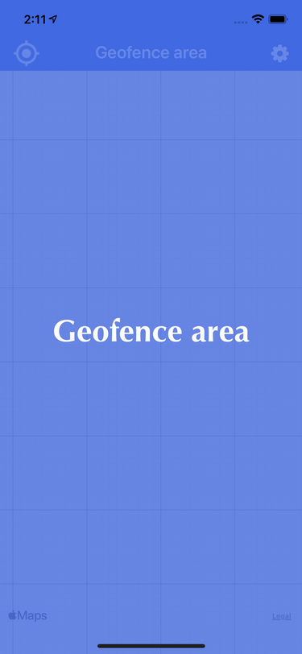
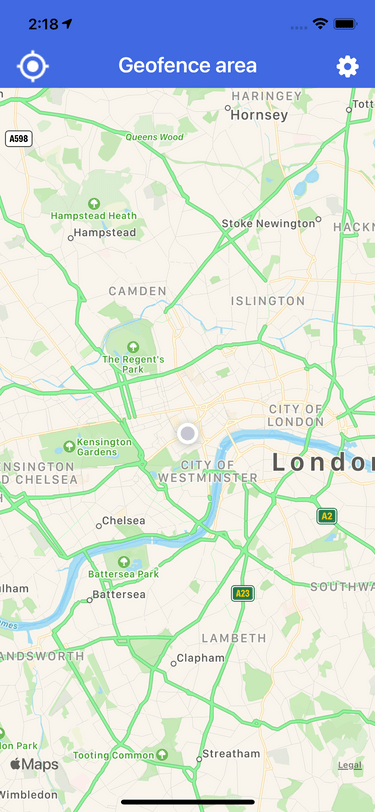
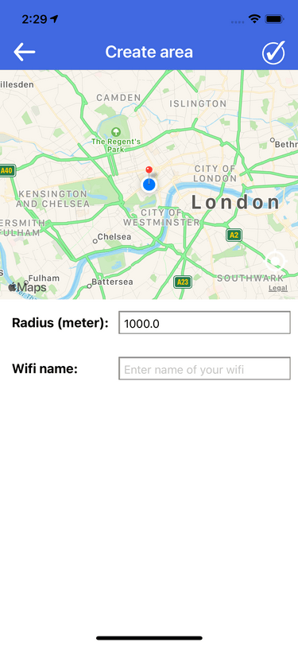
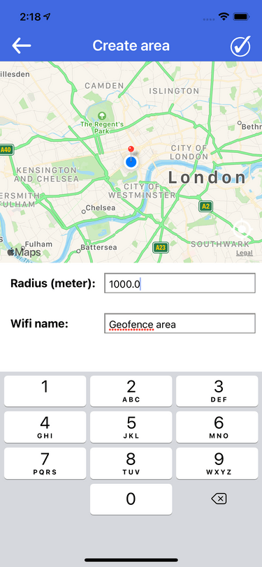
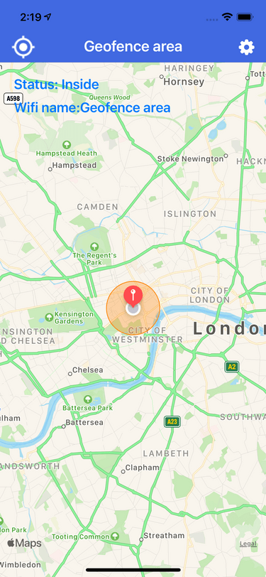
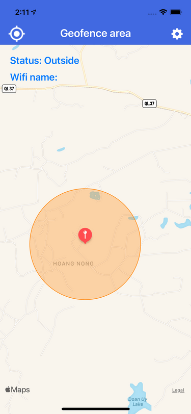

# GeofenceArea

Geofence area is defined as a combination of some geographic point, radius, and specific Wifi network name. A device is considered to be inside of the geofence area if the device is connected to the specified WiFi network or remains geographically inside the defined circle. 

This is main screen, showing the map, current location, and geofence area:

Click right button at top screen, It'll show the Create geofence area screen:

Enter radius and wifi name:

After that, click right button at top screen. It'll back to main screen and show new geofence area and status:

    +) If device is inside area: 

    
    +) If device is outside area:

